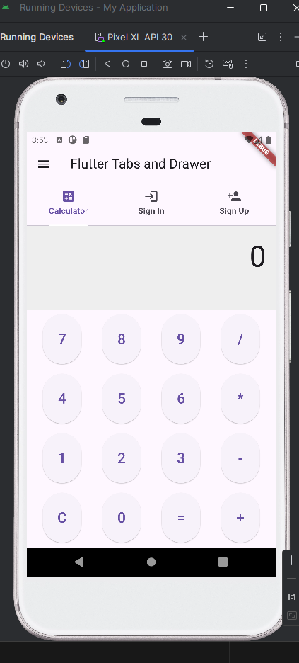
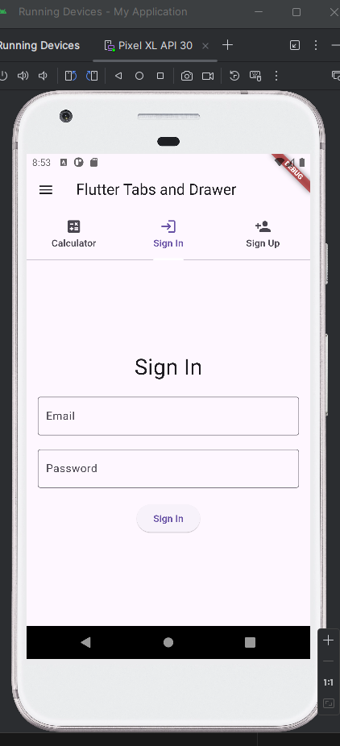
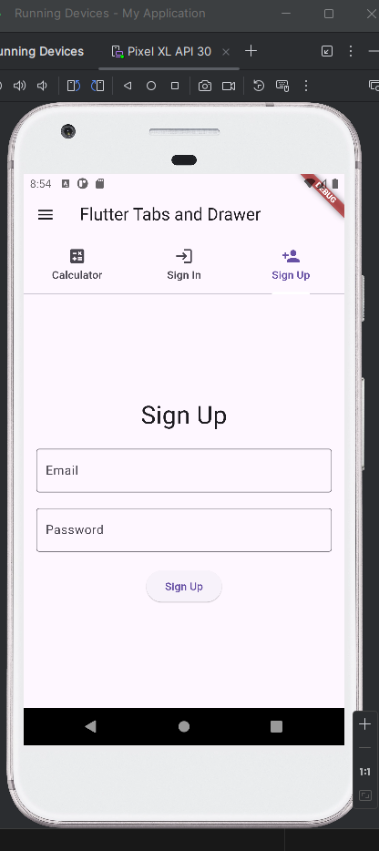

## Author

- **ID**: 24711
- **Name**: Kamali Olivier


# Flutter Tabs and Drawer App

This Flutter project demonstrates how to use tabs and a navigation drawer to switch between different screens: a Calculator, a Sign-In screen, and a Sign-Up screen.

## Table of Contents
- [Author](#author)
- [Introduction](#introduction)
- [Features](#features)
- [Getting Started](#getting-started)
  - [Prerequisites](#prerequisites)
  - [Installation](#installation)
- [Usage](#usage)
- [Screenshots](#screenshots)


## Introduction

This application showcases a basic Flutter app with a TabBar and Drawer for navigation. It includes three main screens:

- **Calculator Screen**: A simple calculator to perform basic arithmetic operations.
- **Sign-In Screen**: A mock sign-in form.
- **Sign-Up Screen**: A mock sign-up form.

## Features

- Tab navigation between Calculator, Sign-In, and Sign-Up screens.
- Drawer navigation for quick access to each screen.
- Basic calculator functionality.
- Simple and user-friendly UI.

## Getting Started

### Prerequisites

- [Flutter SDK](https://flutter.dev/docs/get-started/install)
- [Dart SDK](https://dart.dev/get-dart)
- An IDE or text editor of your choice (e.g., [Android Studio](https://developer.android.com/studio), [Visual Studio Code](https://code.visualstudio.com/))

### Installation

1. Clone the repository:

    ```sh
    git clone https://github.com/your-username/flutter-tabs-drawer-app.git
    ```

2. Navigate to the project directory:

    ```sh
    cd flutter-tabs-drawer-app
    ```

3. Install dependencies:

    ```sh
    flutter pub get
    ```

4. Run the app:

    ```sh
    flutter run
    ```

## Usage

After running the app, you will see an AppBar with tabs for navigation and a Drawer for additional navigation options.

- **Calculator Tab**: Perform basic arithmetic operations.
- **Sign-In Tab**: Fill in the form to mock a sign-in process.
- **Sign-Up Tab**: Fill in the form to mock a sign-up process.

## Screenshots


### Calculator Screen



### Sign-In Screen



### Sign-Up Screen




